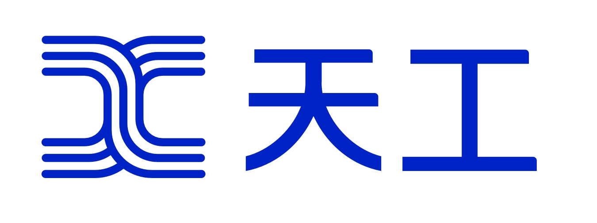

<div align="center">


  <div>&nbsp;</div>
</div>

# Skywork Reward Model Series

## Introduction

[**Skywork-Reward-Gemma-2-27B**](https://huggingface.co/Skywork/Skywork-Reward-Gemma-2-27B) and [**Skywork-Reward-Llama-3.1-8B**](https://huggingface.co/Skywork/Skywork-Reward-Llama-3.1-8B) are two advanced reward models built on the [gemma-2-27b-it](https://huggingface.co/google/gemma-2-27b-it) and [Meta-Llama-3.1-8B-Instruct](https://huggingface.co/meta-llama/Meta-Llama-3.1-8B-Instruct) architectures, respectively. Both models were trained using the [Skywork Reward Data Collection](https://huggingface.co/collections/Skywork/skywork-reward-data-collection-66d7fda6a5098dc77035336d) containing only 80K high-quality preference pairs sourced from publicly available data.

We include only public data in an attempt to demonstrate that high-performance reward models can be achieved with a relatively small dataset and straightforward data curation techniques, without further algorithmic or architectural modifications. The sources of data used in the [Skywork Reward Data Collection](https://huggingface.co/collections/Skywork/skywork-reward-data-collection-66d7fda6a5098dc77035336d) are detailed in the [Data Mixture](#data-mixture) section below.

The resulting reward models excel at handling preferences in complex scenarios, including challenging preference pairs, and span various domains such as mathematics, coding, and safety. As of September 2024, they hold the first and the third positions on the [RewardBench leaderboard](https://huggingface.co/spaces/allenai/reward-bench).

## Data Mixture

Instead of relying on existing large preference datasets, we carefully curate the [Skywork Reward Data Collection](https://huggingface.co/collections/Skywork/skywork-reward-data-collection-66d7fda6a5098dc77035336d) (1) to include high-quality preference pairs and (2) to target specific capability and knowledge domains. The curated training dataset consists of approximately 80K samples, subsampled from multiple publicly available data sources, including

1. [HelpSteer2](https://huggingface.co/datasets/nvidia/HelpSteer2)
2. [OffsetBias](https://huggingface.co/datasets/NCSOFT/offsetbias)
3. [WildGuard (adversarial)](https://huggingface.co/allenai/wildguard)
4. Magpie DPO series: [Ultra](https://huggingface.co/datasets/argilla/magpie-ultra-v0.1), [Pro (Llama-3.1)](https://huggingface.co/datasets/Magpie-Align/Magpie-Llama-3.1-Pro-DPO-100K-v0.1), [Pro](https://huggingface.co/datasets/Magpie-Align/Magpie-Pro-DPO-100K-v0.1), [Air](https://huggingface.co/datasets/Magpie-Align/Magpie-Air-DPO-100K-v0.1).

**Disclaimer: We made no modifications to the original datasets listed above, other than subsampling the datasets to create the Skywork Reward Data Collection.**

During dataset curation, we adopt several tricks to achieve both performance improvement and a balance between each domain, without compromising the overall performance:

1. We select top samples from math, code, and other categories in the combined Magpie dataset independently, based on the average ArmoRM score provided with the dataset. We subtract the ArmoRM average scores in the Magpie-Air subset and the Magpie-Pro subset by 0.1 and 0.05, respectively, to prioritize Magpie-Ultra and Magpie-Pro-Llama-3.1 samples.
2. Instead of including all preference pairs in WildGuard, we first train a reward model (RM) on three other data sources. We then (1) use this RM to score the chosen and rejected responses for all samples in WildGuard and (2) select only samples where the chosen response's RM score is greater than the rejected response's RM score. We observe that this approach largely preserves the original performance of Chat, Char hard, and Reasoning while improving Safety. For both models, we use the 27B model to score the WildGuard samples.

## RewardBench Leaderboard

We evaluate our model on [RewardBench](https://huggingface.co/spaces/allenai/reward-bench) using the [official test script](https://github.com/allenai/reward-bench). As of September 2024, Skywork-Reward-Gemma-2-27B and Skywork-Reward-Llama-3.1-8B rank first and third on the RewardBench leaderboard.

| Rank  | Model                       | Chat  | Chat Hard | Safety | Reasoning | Score |
| :---: | --------------------------- | :---: | :-------: | :----: | :-------: | :---: |
|   1   | Skywork-Reward-Gemma-2-27B  | 95.8  |   91.4    |  92.0  |   96.2    | 93.9  |
|   2   | SFR-LLaMa-3.1-70B-Judge-r   | 96.9  |   84.8    |  92.2  |   97.6    | 92.8  |
|   3   | Skywork-Reward-Llama-3.1-8B | 96.1  |   87.3    |  90.6  |   96.1    | 92.5  |
|   4   | Nemotron-4-340B-Reward      | 95.8  |   87.1    |  92.2  |   93.6    | 92.2  |
|   5   | ArmoRM-Llama3-8B-v0.1       | 96.9  |   76.8    |  92.2  |   97.3    | 90.8  |
|   6   | internlm2-20b-reward        | 98.9  |   76.5    |  89.9  |   95.8    | 90.3  |

## Demo Code

We provide example usage of the Skywork reward model series below. Please note that:

1. We removed the BOS token from the chat templates of the two models to prevent it being added twice during `apply_chat_template` and tokenization.
2. To enable optimal performance for the 27B reward model, ensure that you have enabled either the `flash_attention_2` or `eager` implementation. The default `spda` implementation may result in bugs that could significantly degrade the model's performance for this particular model.

Below is an example of obtaining the reward scores of two conversations.

```python
import torch

from transformers import AutoModelForSequenceClassification, AutoTokenizer

# Load model and tokenizer
device = "cuda:0"
model_name = "Skywork/Skywork-Reward-Gemma-2-27B"
rm = AutoModelForSequenceClassification.from_pretrained(
    model_name,
    torch_dtype=torch.bfloat16,
    device_map=device,
    attn_implementation="flash_attention_2",
    num_labels=1,
)
rm_tokenizer = AutoTokenizer.from_pretrained(model_name)

prompt = "Jane has 12 apples. She gives 4 apples to her friend Mark, then buys 1 more apple, and finally splits all her apples equally among herself and her 2 siblings. How many apples does each person get?"
response1 = "1. Jane starts with 12 apples and gives 4 to Mark. 12 - 4 = 8. Jane now has 8 apples.\n2. Jane buys 1 more apple. 8 + 1 = 9. Jane now has 9 apples.\n3. Jane splits the 9 apples equally among herself and her 2 siblings (3 people in total). 9 ÷ 3 = 3 apples each. Each person gets 3 apples."
response2 = "1. Jane starts with 12 apples and gives 4 to Mark. 12 - 4 = 8. Jane now has 8 apples.\n2. Jane buys 1 more apple. 8 + 1 = 9. Jane now has 9 apples.\n3. Jane splits the 9 apples equally among her 2 siblings (2 people in total). 9 ÷ 2 = 4.5 apples each. Each person gets 4 apples."

conv1 = [{"role": "user", "content": prompt}, {"role": "assistant", "content": response1}]
conv2 = [{"role": "user", "content": prompt}, {"role": "assistant", "content": response2}]

# Format and tokenize the conversations
conv1_formatted = rm_tokenizer.apply_chat_template(conv1, tokenize=False)
conv2_formatted = rm_tokenizer.apply_chat_template(conv2, tokenize=False)
conv1_tokenized = rm_tokenizer(conv1_formatted, return_tensors="pt").to(device)
conv2_tokenized = rm_tokenizer(conv2_formatted, return_tensors="pt").to(device)

# Get the reward scores
with torch.no_grad():
    score1 = rm(**conv1_tokenized).logits[0][0].item()
    score2 = rm(**conv2_tokenized).logits[0][0].item()
print(f"Score for response 1: {score1}")
print(f"Score for response 2: {score2}")

# Output:
# Score for response 1: 9.1875
# Score for response 2: -17.875
```

## Declaration and License Agreement

### Declaration

We hereby declare that the Skywork model should not be used for any activities that pose a threat to national or societal security or engage in unlawful actions. Additionally, we request users not to deploy the Skywork model for internet services without appropriate security reviews and records. We hope that all users will adhere to this principle to ensure that technological advancements occur in a regulated and lawful environment.

We have done our utmost to ensure the compliance of the data used during the model's training process. However, despite our extensive efforts, due to the complexity of the model and data, there may still be unpredictable risks and issues. Therefore, if any problems arise as a result of using the Skywork open-source model, including but not limited to data security issues, public opinion risks, or any risks and problems arising from the model being misled, abused, disseminated, or improperly utilized, we will not assume any responsibility.

### License Agreement

The community usage of Skywork model requires [Skywork Community License](https://github.com/SkyworkAI/Skywork-Reward/blob/main/misc/Skywork%20Community%20License.pdf). The Skywork model supports commercial use. If you plan to use the Skywork model or its derivatives for commercial purposes, you must abide by terms and conditions within [Skywork Community License](https://github.com/SkyworkAI/Skywork-Reward/blob/main/misc/Skywork%20Community%20License.pdf).

## Technical Report

Coming soon. Please stay tuned.

## Contact

If you have any questions, please feel free to reach us at <yuhao.liuu@kunlun-inc.com> or <liang.zeng@kunlun-inc.com>.

## Citation

If you find our work helpful, please feel free to cite us using the following BibTeX entry:

```bibtex
@misc{skyworkreward2024,
  title={Skywork Reward Model Series},
  author={Liu, Chris Yuhao and Zeng, Liang},
  year={2024},
  month={September},
  howpublished={\url{https://huggingface.co/Skywork}},
  url={https://huggingface.co/Skywork},
}
```
